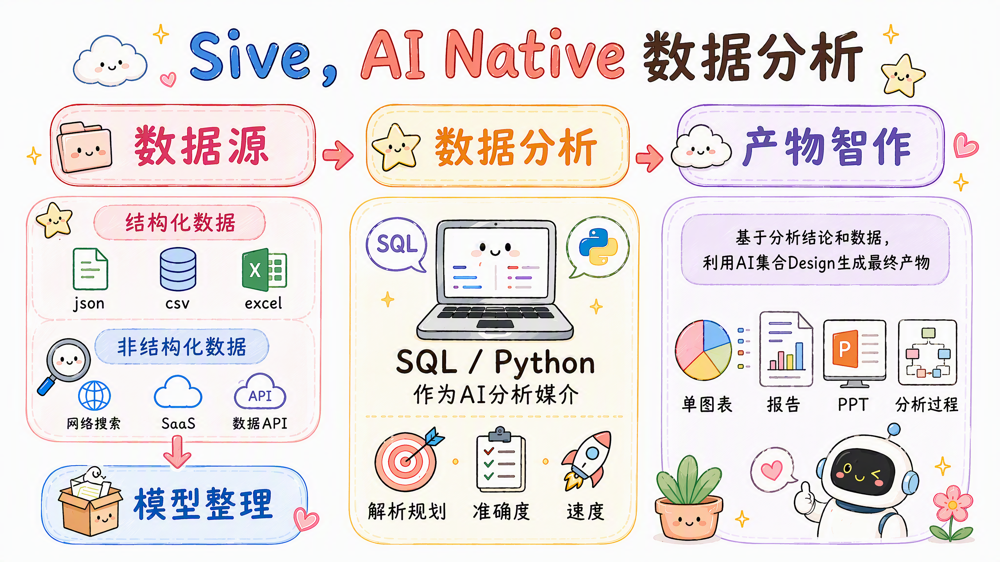

 [English](https://github.com/antvis/Sive/blob/main/README_EN.md) | 中文

<p align="center">
  <a href="https://sive.antv.antgroup.com">
    
  </a>
</p>

<h1 align="center">🪼 Sive, See it Live, Share it Real.</h1>

蚂蚁集团 AntV 团队出品的 AI 驱动的数据可视化创作平台，用自然语言对话快速构建数据可视化图表、报告，以及数据分析，**让数据跃然眼前，让每一份洞察即刻可见、轻松分享**。

<p align="center">
  
</p>

<div align="center">

[](LICENSE)

[](https://github.com/antvis/sive/issues)

</div>

## 👩🏻‍💻 关于我们

AntV 是由蚂蚁集团发起，并自 2017 年起开源，将图形语法理论融入 JavaScript 语言，重新定义了数据可视化，包括 统计分析、图分析、地理分析 以及 非结构化数据可视化。

随着 AI 的演进，AntV 除了开源了一系列的面向 AI 的可视化技术方案之外，还推出了 Sive —— 面向 AI 时代的可视化研发、分析、创作平台，将 AntV 多年沉淀的数据可视化与分析能力交给 AI，让每个人、每个 AI Agent 都能更简单地理解数据、发现洞察并完成创作。

## 🪼 Sive 能做什么

- 数据接入

Sive 支持多种数据接入方式，覆盖本地文件、主流 SaaS 平台、MySQL 等关系型数据库及远程文件，并通过语义建模、AI 取数与业务数据画像，让模型更准确地理解你的数据。

- 数据分析

基于真实业务实践，沉淀 18+ 种数据分析方法和 100+ 条 Golden Queries。只需用自然语言提出业务问题，Sive 即可自动拆解分析任务，从多个维度查询、比较数据，识别趋势、异常、差异及关键影响因素。

- 数据创作

从一张图表、一份分析报告，到一套数据 PPT，依托 10+ 可视化库与 50+ 专业 Design Skills，结合对话、元素拾取、截图等灵活编辑方式，只需 2–5 分钟，即可将数据变成专业、可编辑、可分享的数据作品。

- 开放能力

免费申请 API Key，只需一条 Prompt，即可将 Sive 接入本地 Agent 工作流，让 Agent 不再止于文字回答，还能真正完成数据分析、图表生成与报告创作。

## 🎨 数据作品集

展示一些 Sive 创建的数据作品，扫码即可看到作品的具体内容，来 Sive 也可以创建同款！

<table>
  <tr>
    <td align="center" width="25%">
      <a href="https://sive.antv.antgroup.com/yG7JgAvXn1N4RQV06rO8" data-application-id="yG7JgAvXn1N4RQV06rO8" target="_blank" rel="noopener">
        
      </a>
    </td>
    <td align="center" width="25%">
       <a href="https://sive.antv.antgroup.com/rx5pdyPR8GbD9NVkK4Jj" data-application-id="rx5pdyPR8GbD9NVkK4Jj" target="_blank" rel="noopener">
        
       </a>
    </td>
    <td align="center" width="25%">
       <a href="https://sive.antv.antgroup.com/KjpgNDy9gnmvzEJZxnl4" data-application-id="KjpgNDy9gnmvzEJZxnl4" target="_blank" rel="noopener">
        
       </a>
    </td>
    <td align="center" width="25%">
       <a href="https://sive.antv.antgroup.com/Kepl0j19EEQG9dPr8Z2E" data-application-id="Kepl0j19EEQG9dPr8Z2E" target="_blank" rel="noopener">
        
       </a>
    </td>
  </tr>
  <tr>
    <td align="center" width="25%">
       <a href="https://sive.antv.antgroup.com/eD6aPMgRkPN8X27GpwQJ" data-application-id="eD6aPMgRkPN8X27GpwQJ" target="_blank" rel="noopener">
        
       </a>
    </td>
    <td align="center" width="25%">
      <a href="https://sive.antv.antgroup.com/YAgb6DW9ae3Q9mwxprkl" data-application-id="YAgb6DW9ae3Q9mwxprkl" target="_blank" rel="noopener">
        
      </a>
    </td>
    <td align="center" width="25%">
       <a href="https://sive.antv.antgroup.com/2L5kBeJX4lQgXgP4YlbG" data-application-id="2L5kBeJX4lQgXgP4YlbG" target="_blank" rel="noopener">
        
       </a>
    </td>
    <td align="center" width="25%">
       <a href="https://sive.antv.antgroup.com/oAqbY5dRr5YE920VeE4J" data-application-id="oAqbY5dRr5YE920VeE4J" target="_blank" rel="noopener">
        
       </a>
    </td>
  </tr>
  <tr>
    <td align="center" width="25%">
      <a href="https://sive.antv.antgroup.com/gkMvYyazWpy392rE38Nw" data-application-id="gkMvYyazWpy392rE38Nw" target="_blank" rel="noopener">
        
      </a>
    </td>
    <td align="center" width="25%">
      <a href="https://sive.antv.antgroup.com/NADVaGQL9OGp91pYxvm6" data-application-id="NADVaGQL9OGp91pYxvm6" target="_blank" rel="noopener">
        
      </a>
    </td>
    <td align="center" width="25%">
      <a href="https://sive.antv.antgroup.com/n6gdvP8zyxvyXOGqNLB0" data-application-id="n6gdvP8zyxvyXOGqNLB0" target="_blank" rel="noopener">
        
      </a>
    </td>
    <td align="center" width="25%">
      <a href="https://sive.antv.antgroup.com/lAxGEmgzPP3lz5o3DYpe" data-application-id="lAxGEmgzPP3lz5o3DYpe" target="_blank" rel="noopener">
        
      </a>
    </td>
  </tr>
</table>

<h2 align="center">✨ 在 AI 工具中使用</h2>

AntV [Sive](https://sive.antv.antgroup.com/) 提供了 `API Key` 来支持在 AI 工具中免费使用，只需要登录之后在 个人中心 - 设置 - API key 中即可免费创建 API Key，然后复制以下提示词发送给本地 AI，即可生成「Sive 数据分析 Skill」。

```
本文档提供了 AI 数据分析能力 Skill 的安装方式，按照本文档在本地 AI 环境中生成「Sive 数据分析 Skill」，保证信息不要丢失。

1. 询问用户输入 Sive 数据分析的 <API Key>，在 [Sive](https://sive.antv.antgroup.com/) 产品 「个人 - 设置 - API Key」 中免费创建。
2. 加载 Sive 提供的 OpenAPI 接口文档 https://sive.antv.antgroup.com/api/open/v1/load-sive-skills。
3. 基于加载的信息，在本地 AI 环境中生成 「Sive 数据分析 Skill」，确保 Skill 的名称和描述符合规范。

安装成功之后，基于「Sive 数据分析 Skill」，就可以做一些数据的导入、查询分析、以及可视化，例如：

> 帮我加载本地 csv 文件『sales.csv』，分析 『最近 10 天的销售额趋势』，最终绘制成折线图。
```

支持在  Claude、 CodeX、 Cursor、 Workbuddy、 DeepSeek Harness、 千问办公、 Trae 等 70+ AI 工具中使用。

---

<p align="center">
  <a href="https://antv.vision">
    
  </a>
</p>

<p align="center">「蚂蚁企业级 AI 数据可视化解决方案，让人们在数据世界里获得视觉化思考能力」</p>

<p align="center">
  Made with ❤️ by <a href="https://sive.antv.antgroup.com/">AntV Sive</a>
</p>
